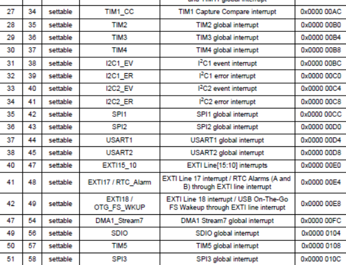

Лабораторная работа №4

Код с лекции (main):

----

//#include <cstdint>   //for int types such as uint32_t
#include "gpioaregisters.hpp" //for Gpioa
#include "gpiocregisters.hpp" //for Gpioc
#include "gpiobregisters.hpp" //for Gpiob
#include "rccregisters.hpp"   //for RCC
#include "tim5registers.hpp"   //for SPI2
#include "nvicregisters.hpp"  //for NVIC

using namespace std ;

extern "C"
{
int __low_level_init(void)
{
  RCC::CR::HSION::On::Set() ; // подключение внутр. частоты
  while(!RCC::CR::HSIRDY::Ready::IsSet()) 
  {
  }
  RCC::CFGR::SW::Hsi::Set();
  while(!RCC::CFGR::SWS::Hsi::IsSet())
  {
  }
  
RCC::APB1ENR::TIM5EN::Enable::Set(); //подключили таймер 5
RCC::AHB1ENR::GPIOCEN::Enable::Set(); //тактирование пртов С
RCC::AHB1ENR::GPIOAEN::Enable::Set(); //тактирование пртов А
  
GPIOC::MODER::MODER5::Output::Set(); //порт С 5 выход
GPIOC::MODER::MODER9::Output::Set(); // порт С 9 выход 
GPIOC::MODER::MODER8::Output::Set(); // порт С 8 выход
GPIOA::MODER::MODER5::Output::Set(); // порт А 5 выход 
      
  
   NVIC::ISER1::Write(1 << 18) ; // глобальное прерывание
   TIM5::PSC::Write(15999) ; // деление на 1600
   TIM5::DIER::UIE::Value1::Set() ; // разрешение прерываний
  return 1;
}
}

int main()
{
  TIM5::ARR::Write(2000) ; // скорость мигания 
  TIM5::SR::UIF::NoUpdate::Set(); // не обновлять флаг прерываний 
  TIM5::CNT::Write(0); // "0" в счетчик
  TIM5::CR1::CEN::Enable::Set() ;  // включение счетчика
  
  for(;;)
  {
  }
  
  return 0 ;
}

----

В таблице векторов прерываний в startup записываем адреса обработчиков для каждого вектора до адреса вектора tim5 (57) по мануалу.

[source, C]

----

  InterruptHandler::Timer2Handler,         //TIM2  	
  InterruptHandler::DummyHandler,         //TIM3
  InterruptHandler::DummyHandler,        ////TIM4
  InterruptHandler::DummyHandler,        //I2C1_EV
  InterruptHandler::DummyHandler, //I2C1_ER
  InterruptHandler::DummyHandler, //I2C2_EV
  InterruptHandler::DummyHandler, // I2C2_ER
  InterruptHandler::DummyHandler, //SPI1
  InterruptHandler::DummyHandler, //SPI2
  InterruptHandler::DummyHandler, //USART1
  InterruptHandler::DummyHandler, //USART2
  0, 
  InterruptHandler::DummyHandler, //EXTI15_10
  InterruptHandler::DummyHandler, //EXTI17 / RTC_Alarm
  InterruptHandler::DummyHandler, //EXTI18 /OTG_FS_WKUP
  0,
  0,
  0,
  0,
  InterruptHandler::DummyHandler,  //DMA1_Stream7
  0,
  InterruptHandler::DummyHandler, //SDIO
  InterruptHandler::Timer5Handler, //TIM5
  InterruptHandler::DummyHandler, //SPI3

};

----

Пропишем обработку прерывания для TIM5 в interrupthandler

[source, C]

----

static void Timer5Handler()
{
if(TIM5::SR::UIF::UpdatePending::IsSet()) //ожидание обновления прерывания
    {
    TIM5::SR::UIF::NoUpdate::Set(); //не обновлять флаг прерываний
    GPIOC::ODR::Toggle((1 << 8)|(1 << 5)|(1 << 9)) ; //изменить значение 8,5 и 9 бита в GPIOC
    GPIOA::ODR::Toggle(1 << 5) ; //изменить значение 5 бита в GPIOA
    }
}

----
